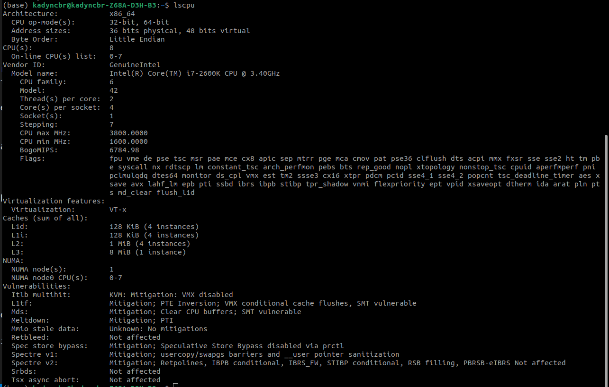

# Parallelized Text Compression
## Project Introduction
### **Goals and objectives**
For this project I set out to create a Text compression solution that could perform lossless compression. The inital goal was to experiment with compressing genome sequences as these are large texts files using a minimal alphabet. The idea was to perform a Burrows Wheeler Transform on the text and then apply Run-Length Encoding to reduce the size while still making the original data recoverable.

### **Value of Solution**
Text compression has many uses from minimizing bandwidth in internet transfer, web archival and storage efficiency. The primary use for this project was to reduce the size of genome sequences. However a variety of different test cases are used from small text, to large books, to an actual genome sequence.

### **Numerical methods used**
Numerically, the Run-Length encoding requires summing a run of same characters.
A statistical analysis is also performed on on the resulting files to compare compressed versus original. This analysis is used as a numerical verifcation of correctness and completeness of the entire process.

### **Parallel Programming methods used**
OpenMP was employed to perform the parallelism. Interestingly, a situation arises in which the work done by the algorithm changes depending on how the problem is divided and conquered. This phenomenon will be discussed more in depth in the parallel design section ahead.

This algorithm original was very memory constrained, despite not employing MPI, its worth noting that this would make an excellent candidate as distributed memory would have assisted in performing the operations as they were originally designed. This entire process would benefit greatly from node scaling due to memory and IO bottlenecks inherently present in the original memory constraied burrows wheeler transform implementation.

## Overall Description
The program is broken into phases:
- Inital Read 
- Forward Pass (**Parallel Phase 1**)
  - Burrows-Wheeler Transform
  - Run-Length Encoding
- Write Compressed File
- Read Compresed File
- Backward Pass (**Parallel Phase 2**)
  - Run-Length Decoding
  - Inverse Burrows-Wheeler Transform
- Analysis & comparison

Only the Forward Pass and Backward pass are individually timed (`forward_pass_time` and `backward_pass_time` respectively), where as the `total_time` accounts for the entire program running. These three metrics will be used extensively throughout the report to demonstrate not only sectional speedup but overall program speedup.

## Test Machine Description
The machine used to test build and test these experiments was a 4-core (8 thread) Intel i7-2600k stock processor, **Figure 1.1** shows a screen shot of lscpu. The machine runs a headless Ubuntu 22.04 server edition with minimal noise, **Figure 1.2** shows a screen shot of an idle htop demonstrating the idle load.

## Build Description
The makefile is included. 
>Its worth pointing out that the data was captured with compiler optimization -02 initially set. This will be important as this caused some skewed results which will be discussed in the scaling and amdahl section of the report.

## Test Case Description
Metrics were gathered using a python script `evaluate.py`.

Test cases:

| File name       | description                               | Size on disk | Character count |
| --------------- | ----------------------------------------- | ------------ | --------------- |
| ban.txt         | banana.                                   | 4.0K         | 10              |
| onemeglorem.txt | 1,050,000~ characters of lorem ipsum.     | 1.0M         | 1048576         |
| lorem.txt       | 3,000,000~ characters of lorem ipsum.     | 2.9M         | 3000635         |
| bible.txt       | The bible in plain text                   | 3.9M         | 4047392         |
| E.coli          | The full Escherichia Coli genome sequence | 4.5M         | 4638690         |

## Sequential
### **Sequential Solution**
The original sequential solution was obtained from rosetta code[1] but has since so heavy a refactor and modification that it may as well be a different architected solution altogether. The reason for this was due to the poor implementations found on rosetta code which were incredibly memory inefficient.

Since the original algorithm had a space complexity of O(n^2), performing the operation on a 1MB file would require ~1000GB of memory.

This was then changed to use an in-place version of the Burrows-Wheeler Transform[2] which was performed in-place.

### **Time measurement for sequential**
| input                 | num_threads | iter | forward_pass_time | backward_pass_time | original_size | compressed_size | bytes_saved | percent_of_original | total_time |
| --------------------- | ----------- | ---- | ----------------- | ------------------ | ------------- | --------------- | ----------- | ------------------- | ---------- |
| tests/ban.txt         | 1           | 3    | 0.000240          | 0.000184           | 30            | 22              | 8           | 73.33%              | 0.000927   |
| tests/onemeglorem.txt | 1           | 3    | 140.672769        | 23.488458          | 1048576       | 107090          | 941486      | 10.21%              | 164.162789 |
| tests/lorem.txt       | 1           | 3    | 382.483935        | 63.467176          | 3000635       | 305749          | 2694886     | 10.19%              | 445.960234 |
| tests/bible.txt       | 1           | 3    | 519.981785        | 93.942509          | 4047392       | 1951539         | 2095853     | 48.22%              | 613.934377 |
| tests/E.coli          | 1           | 3    | 615.576736        | 304.536144         | 4638690       | 4234304         | 404386      | 91.28%              | 920.127969 |

A visual plot of the above can be seen in **Figure 2.1**, with each individual pass being shown in **Figure 2.2**.

## Parallel Design and Solution
### **Parallel Solution**
The strategy for dividing and conquer was to divide the stream of characters itself into blocks. Each individual block would then have the passes performed on it maintaining isolation until after the backward phase, where the results of the backward phase are combined to make the original data. This particular method was chosen after exhaustively trying to parallelize the other components.
<!-- Should Make infographic examples of these cases? -->
- Burrows wheeler Transform:
  - Unable to effectively be parallelized in any non trivial way due to having to obtain the suffix array and then sort using that suffix array. This effectively creates a loop carry dependency.
- Run-Length Encoding:
  - Unable to be parallelized as you need to iterate through each individual character in order to sum up the run length. Even if this weren't the case, due to how this section is decoded, you would need to make building the encoded string a critical section effectively waiting for the previous section/character-run before starting the current one.
- Run-Length Decoding:
  - While expanding the Run-lengths itself could potentially be parallelized, one would need to be careful with how the data is split. In this regard it offers up more trouble than its worth as performing a search to find a splitting point would take as long as just expanding the encoding. 
- Inverted Burrows Wheeler Transform:
  - Inverting the Burrows Wheeler Transform involves using the first-last pairs to rebuild the suffix array. This process is itself an uncompromisingly iterative one.

This leads us back to if none of these phases parallelize in any sort of trivial matter, they can all be run in parallel using isolated blocks.

#### Header addition
In order to achieve this, I had to make sure the blocks were recoverable. To that end I created a header type which would function as instructions for how to parse the file to extract the blocks exactly as they were placed during the compression step.

### **Time measurement for Parallel**
Below is a figure showing the average time to perform the full forward and backward operation with varying threads.


This falls in line with the computer being used to test as it only had 8 cores.

Further datapoints can be seen in the table shown in **Figure 3.1**

## Speed-up and scaling analysis

### **Amdahl's Law Parameters**
S = 32 (4 cores * 2 threads * 4 `(4 to account for superscalar and ILP which had a massive effect on run time.)`)


One of the test cases was using loremipsum generated text which contained exactly 1 Megabyte of data. This is the case that I think is most representative of the goal as well as gives a clear baseline to the performance with a non-trivial amount of data.

The following figure shows the speed up in relation to the amount of threads.


The speed up is close to being exactly linear. 

### **Comparison of Amdahls law and actual speedup**
For this specific case, this closely resembles Amdahls law in regards to scaling linearly. 


### **Cherry Picked explaination**
This case however is the only one that behaves well.


| Test case: Bible.txt               | Test case: E.coli                   |
| ---------------------------------- | ----------------------------------- |
|  |  |

In both the above images, the linear scaling is absent in fact it seems to degrade beyond 4 threads, however the speedup is still present over single threaded, even beyond the point of what seems to be diminishing returns. The reason for this is twofold. 

<!-- This important. -->
Due to the nature of the inplace_bwt algorithm shown in **Figure 4.1**, the time complexity of this algorithm is O(n^2), or more closely, O(n * 3n). When splitting the data into blocks, there eventually becomes a critical point where the operations on the blocks become quicker than the operation performed on the entirety of the data. In this regard blocking out the data changes the amount of work done as a whole. The thread counts themselves play a large role in how the data is portioned for blocking. The blocks are sized based on the number of threads used and the size of the overall data being compressed. Blocks are initally created with the assumption of 0.5Mb blocks. The amount of blocks the program would need are then compared to the amount of threads. If there are more threads then there are blocks, then the blocks are resized to accomodate the number of threads available. 

The second reason behind this is due to superscalar instructions which were not turned off during collection of this data. As seen in the inplace_bwt **Figure 4.1**, the program spends most of its time here performing simple and repeated operations. This benefits a lot from ILP.

>Running the entirety of the tests with -O2, the tests took around 5 hours to complete. Changing -O2 to -O0, caused the testing to go well above 10+ hours. I expect this to be because the ILP speedup for the longest part of the program (inplace_bwt) was doing a lot of heavy lifting.


### **Percent Parallel**
Our 1Mb lorem test case shows an increasing P 


This of course must be met with managed expectations as the other larger test cases didn't show as nice an increase to P for the reasons listed above.

| Test case: Bible.txt                           | Test case: E.coli                               |
| ---------------------------------------------- | ----------------------------------------------- |
|  |  |

### **Analysis of correctness**

#### Program Correctness
By nature of a backward pass being part of the test, the program is self evaluating in terms of maintaining lossless compression, a key component of the inital objective.
This was confirmed sequentially and in parallel, if any backward pass didn't match the inital input data, the tests would stop and no analytics would be saved.

#### Bytes saved differences
Since correctness is guarenteed the way this is formulated, the next best metric to look at would be how many bytes were saved in the process of creating the compressed file.
In table **Figure 3.1**, we can see a run down of how many bytes were saved in conversion with relation to each input and each thread_count. Since the number of threads define how the data is segmented, and those segments determine the characters that actually get transformed and encoded, this means that the number of threads have a say in how much data is compressed to some degree. It's mostly weighted by block sizes.


#### **Banana expansion**
In most cases relating to the ban.txt test case, its observed that the compression file was actually larger than the original file. This is due to the the fact that along with compression, a header is created in order to decompress with the same blocks. In this situation the size and overhead of the header with compressed encoding is larger than the input data. This implies there is a lower bound in terms of size in which this algorithm doesn't perform.

#### **Different work due to different threads / block sizes**
As was stated earlier, looking through **Figure 3.1**, one can see that the percentage of the original changes. This is due to the fact that the Run-Length encoding has potentially less to encoded due to smaller block sizes. This was discussed in the speed up analysis section above, but this visually demonstrates that the work done is not the same when parallelism is introduced.


in large files, you can see the amount compressed was stable and unchanging. This is due to the input size being so high the block size variability wouldn't have as much an effect.


## Conclusion
The goal was to create a parallelized text compression program. In this regard the goal was met as text does indeed losslessly compress below its original size. The amount compressed and the amount of time required are highly variable and the program itself accounts for this by letting the user tune this process by setting the number of threads and the size of the blocks being compressed. The E.coli example was only compressed at maximum 91% of its original size. This wasn't exactly the low number I was aiming for, but I understand that this is a compromise in the blocksize being set to .5Mb. Despite this, significant speed up can be seen in the process compared to 1 thread at all enumerations. 


# References
1. Rosetta Code
>https://rosettacode.org/wiki/Burrows%E2%80%93Wheeler_transform
2. In-Place BWT
>Maxime Crochemore, Roberto Grossi, Juha Kärkkäinen, Gad M. Landau,
Computing the Burrows–Wheeler transform in place and in small space,
Journal of Discrete Algorithms,
Volume 32,
2015,
Pages 44-52,
ISSN 1570-8667,
https://doi.org/10.1016/j.jda.2015.01.004.
(https://www.sciencedirect.com/science/article/pii/S1570866715000052)

# Appendix
## Figure 1.1: lscpu of test machine


## Figure 1.2: htop of idle test machine


## Figure 2.1: Sequential time Versus Size


## Figure 2.2: Sequential time for each pass


## Figure 3.1: Threaded Run times:
#### 2 Threads
| input                 | num_threads | iter | forward_pass_time | backward_pass_time | original_size | compressed_size | bytes_saved | percent_of_original | total_time |
| --------------------- | ----------- | ---- | ----------------- | ------------------ | ------------- | --------------- | ----------- | ------------------- | ---------- |
| tests/ban.txt         | 2           | 3    | 0.000336          | 0.000156           | 30            | 36              | -1          | 120.00%             | 0.000638   |
| tests/onemeglorem.txt | 2           | 3    | 78.334468         | 13.313754          | 1048576       | 107090          | 941486      | 10.21%              | 91.650199  |
| tests/lorem.txt       | 2           | 3    | 195.161068        | 32.694639          | 3000635       | 305749          | 2694886     | 10.19%              | 227.86377  |
| tests/bible.txt       | 2           | 3    | 273.378110        | 49.592466          | 4047392       | 1951539         | 2095853     | 48.22%              | 322.980627 |
| tests/E.coli          | 2           | 3    | 336.664595        | 167.462232         | 4638690       | 4234304         | 404386      | 91.28%              | 504.141497 |

#### 4 Threads
| input                 | num_threads | iter | forward_pass_time | backward_pass_time | original_size | compressed_size | bytes_saved | percent_of_original | total_time |
| --------------------- | ----------- | ---- | ----------------- | ------------------ | ------------- | --------------- | ----------- | ------------------- | ---------- |
| tests/ban.txt         | 4           | 3    | 0.000350          | 0.000222           | 30            | 43              | -1          | 143.33%             | 0.000698   |
| tests/onemeglorem.txt | 4           | 3    | 47.096851         | 8.083963           | 1048576       | 107090          | 941486      | 10.21%              | 55.182218  |
| tests/lorem.txt       | 4           | 3    | 100.932935        | 17.174367          | 3000635       | 305749          | 2694886     | 10.19%              | 118.115144 |
| tests/bible.txt       | 4           | 3    | 147.392164        | 26.923441          | 4047392       | 1951539         | 2095853     | 48.22%              | 174.32269  |
| tests/E.coli          | 4           | 3    | 180.427658        | 100.785878         | 4638690       | 4234304         | 404386      | 91.28%              | 281.2313   |

#### 8 Threads
| input                 | num_threads | iter | forward_pass_time | backward_pass_time | original_size | compressed_size | bytes_saved | percent_of_original | total_time |
| --------------------- | ----------- | ---- | ----------------- | ------------------ | ------------- | --------------- | ----------- | ------------------- | ---------- |
| tests/ban.txt         | 8           | 3    | 0.004517          | 0.000475           | 30            | 56              | -1          | 186.67%             | 0.005174   |
| tests/onemeglorem.txt | 8           | 3    | 17.436204         | 3.071838           | 1048576       | 190805          | 857771      | 18.20%              | 20.509831  |
| tests/lorem.txt       | 8           | 3    | 97.060676         | 18.436779          | 3000635       | 305749          | 2694886     | 10.19%              | 115.505486 |
| tests/bible.txt       | 8           | 3    | 139.496099        | 41.850698          | 4047392       | 1951539         | 2095853     | 48.22%              | 181.355552 |
| tests/E.coli          | 8           | 3    | 173.107498        | 275.596189         | 4638690       | 4234304         | 404386      | 91.28%              | 448.72009  |

#### 12 Threads
| input                 | num_threads | iter | forward_pass_time | backward_pass_time | original_size | compressed_size | bytes_saved | percent_of_original | total_time |
| --------------------- | ----------- | ---- | ----------------- | ------------------ | ------------- | --------------- | ----------- | ------------------- | ---------- |
| tests/ban.txt         | 12          | 3    | 0.000532          | 0.000345           | 30            | 70              | -1          | 233.33%             | 0.001011   |
| tests/onemeglorem.txt | 12          | 3    | 11.675412         | 1.977297           | 1048576       | 275564          | 773012      | 26.28%              | 13.655327  |
| tests/lorem.txt       | 12          | 3    | 95.148506         | 18.963188          | 3000635       | 305749          | 2694886     | 10.19%              | 114.119796 |
| tests/bible.txt       | 12          | 3    | 140.358995        | 38.436572          | 4047392       | 1951539         | 2095853     | 48.22%              | 178.807455 |
| tests/E.coli          | 12          | 3    | 155.556544        | 276.751283         | 4638690       | 4234304         | 404386      | 91.28%              | 432.328567 |

#### 16 Threads
| input                 | num_threads | iter | forward_pass_time | backward_pass_time | original_size | compressed_size | bytes_saved | percent_of_original | total_time |
| --------------------- | ----------- | ---- | ----------------- | ------------------ | ------------- | --------------- | ----------- | ------------------- | ---------- |
| tests/ban.txt         | 16          | 3    | 0.000709          | 0.000442           | 30            | 81              | -1          | 270.00%             | 0.00134    |
| tests/onemeglorem.txt | 16          | 3    | 8.741097          | 1.478218           | 1048576       | 363805          | 684771      | 34.70%              | 10.221058  |
| tests/lorem.txt       | 16          | 3    | 71.282284         | 12.905874          | 3000635       | 406937          | 2593698     | 13.56%              | 84.194638  |
| tests/bible.txt       | 16          | 3    | 139.779402        | 43.729499          | 4047392       | 1951539         | 2095853     | 48.22%              | 183.524416 |
| tests/E.coli          | 16          | 3    | 172.944976        | 297.530590         | 4638690       | 4234304         | 404386      | 91.28%              | 470.492001 |

## Figure 4.1: TextCompress::inplace_bwt function
```c++
//The algorithm isn't doing the same amount of work, by the nature of dividing and conquering, its splitting up the domain and thus reducing the n^2 operation time significantly

string TextCompress::inplace_bwt(string inp) {
  string rets = inp;
  rets += STX;
  int n = rets.length();
  int i, p, r, s;
  unsigned char c;
  for (s = n - 3; s >= 0; s--) {
    c = rets[s];
    r = s;
    for (i = s + 1; rets[i] != STX; i++)
      if (rets[i] <= c) r++;
    p = i;
    while (i < n)
      if (rets[i++] < c) r++;
    rets[p] = c;
    for (i = s; i < r; i++) {
      rets[i] = rets[i + 1];
    }
    rets[r] = STX;
  }
  return rets;
}
```

## Extra Figures


